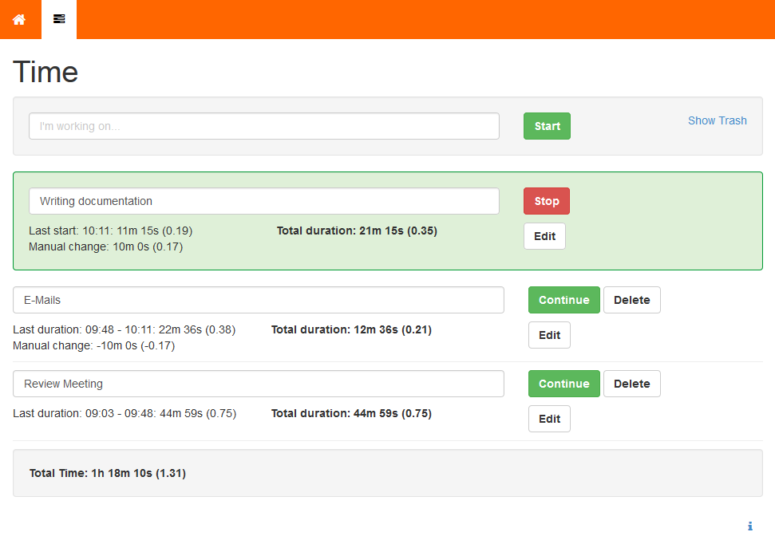

# flok
## Radically Open Business Operation Toolkit
### Brought to you by [Nothing Interactive](https://www.nothing.ch)

## Why 'flok'?
The project's name 'flok' has its roots in the terms 'flock' or 'flocking', the collective motion of a large number of self-propelled entities. The project wants to respect the human's collective, emergent behaviour arising from simple rules that are followed by individuals and doesn't involve any central coordination. This is the reason why we chose flok.to as domain to underline the conceptional idea, even in the URL, e.g. 'flok.to/time'.

flok can be best understood as a toolkit for companies with agile project processes and [Open Business](http://en.wikipedia.org/wiki/Open_business) workflows and therefore will grow with the needs arising while always sticking to the idea of the [Minimum Viable Product (MVP)](https://en.wikipedia.org/wiki/Minimum_viable_product) when iterating its development.

Currently, there's only one single working component in flok at a very early stage: a simple, minimalistic time tracker. It is used to record the amount of time being spent on a specific task. All time tracks are only temporarily stored within the browser's local storage since they're intended to be copied over to a another reporting software for now. There's no server-side database as of yet.

## Screenshots
Because everyone likes screen shots:

## Roadmap
After the very first release which is only a small teaser of what's coming, we take up the following steps to push flok forward. Warning: Radical changes in the available features, the architecture of the application and the used frameworks are always possible!

* General features
    * User authentication and authorisation
    * User profiles incl. personal dashboard
    * Persistence through server-side database
    * Real-time sync across devices
* Collaboration-specific features
    * Global team time-line
    * Note-taking tool for meetings/ dailies
    * To-do list

## Targeted Platforms and Browsers
flok works on desktop as well as on modern, mobile (both smartphone and tablet) operating system browsers. Generally, only the newest version of the widely spread, standard-compliant browsers are supported:

* Chrome
* Firefox
* Safari
* Android Browser
* Chrome for Android
* Mobile Safari

## Setup and Usage
### Dependencies
To be able to install and run flok, you will need:

* Node.js v0.10.29 (or newer, we recommend using the latest version)
* MongoDB v2.4.9 (or newer)
* Git (or you can download the source directly from github)

flok is built with [Express](http://expressjs.com/), [Mongoose](http://mongoosejs.com/), [AngularJS](http://angularjs.org/) and [Bootstrap 3](http://getbootstrap.com/).

As much as possible, we are going to stay on the latest versions of these frameworks. You do not need to install Express, Mongoose, Angular or Bootstrap separately. All the Node.js bundles will be installed through npm and Angular as well as Bootstrap are already included in the repository.

### Installation
* Make sure you have the above listed dependencies installed.
* [Fork the repository](https://help.github.com/articles/fork-a-repo) and clone your fork to your computer.
* Browse to the repository root.
* Install all Node.js bundles: `npm install`.
* Create a config from the config example: `cp config/config-example.js config/config.js` (config.js is ignored by git)
* Check the config to make sure it makes sense for your setup.
* Run the application in dev mode `./node_modules/.bin/supervisor app.js`. This will watch all the files and automatically restart the server when a file changes.
* Done! Access the application on [http://localhost:3000/](http://localhost:3000/).

### Preparing for Production
To run the application in production mode you can use forever:

    npm install -g forever

And then start it:

    NODE_ENV=production forever start app.js

To stop it:

    forever stopall

This will use the `production` settings in `config/config.js`. Make sure the settings make sense for your production environment.

## Contributing
### Running Tests

#### Frontend Tests
[Karma](http://karma-runner.github.io/) is installed as a local node module.

* Start Karma: `./node_modules/.bin/karma start buildtools/karma.conf.js`.
* Access [http://localhost:9876/](http://localhost:9876/) with a browser to execute the tests.
* Karma is configured to watch the JavaScript files and re-execute the test when the files are modified.

#### Backend Tests
[Mocha](http://visionmedia.github.io/mocha/) is used for backend testing.

* Make sure you configured a test db in your config.js
* Run mocha `./node_modules/.bin/mocha components/*/tests/backend/**/*Test.js`

### JSHint
Please respect the coding standards described in the [JSHint](http://www.jshint.com/) config file (_buildtools/.jshintrc_).

### JSDoc
[JSDoc](https://github.com/jsdoc3/jsdoc) is installed as a local node module.

* `./node_modules/.bin/jsdoc -c buildtools/jsdoc.conf.json`
* The documentation is generated in the _doc_ folder

### Plato

We currently generate 2 [Plato](https://github.com/es-analysis/plato) reports:

* One for components
  * `./node_modules/.bin/plato --jshint=buildtools/.jshintrc --title="Flok Components" --dir=doc/components -x "tests/" --recurse --noempty components`
* One for the core
  * `./node_modules/.bin/plato --jshint=buildtools/.jshintrc --title="Flok Core" --dir=doc/core --recurse --noempty public/app`

### Bower
We use bower to manage vendors scripts. After installing it with `npm install` you should run:

    ./node_modules/.bin/bower install

### Less
The `flok.css` must be generated from the less files found in `dev/less`. The appropriate version of less is
in the package.json.

To build the less files (from the project root):

    ./node_modules/.bin/lessc dev/less/flok.less > public/css/flok.css

## Version History

### 0.4.0 - 2014-11-28
* Removed Homepage, default component can be configured
* Added Activity Component
* Added backend testing
* Updated dependencies, notably now using angular 1.3
* Updated components now loaded using modular system
* Updated config can now be accessible by components
* Updated core now has a prototype users concept

### 0.3.0 - 2014-07-18
* Switched whole application to ExpressJS instead of Symfony.
* Added basic storage of the data from the Time component in a MongoDB database.

### 0.2.0 - 2013-11-13
* Initial release: Launched with Time component.

## Copyright and license
* Brought to you by Nothing Interactive, Switzerland
* Website: [https://www.nothing.ch/](https://www.nothing.ch/)
* Version: 0.4.0
* License: [The MIT License (MIT)](http://opensource.org/licenses/MIT)
